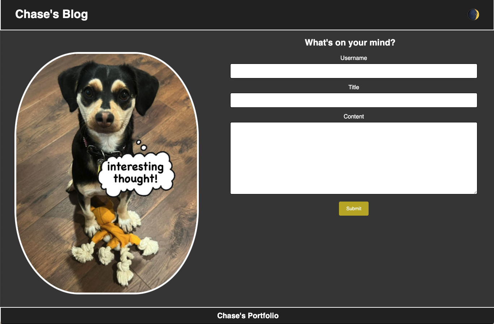

# Chase's Personal Blog

## Description

Welcome to Chase's blog! Here you can post whatever you'd like, and it will be saved on local storage. All of your posts will be displayed on the blog post part of the web app.

## Usage

The blog can be reached at https://cfriedman2156.github.io/Personal-Blog/

Enter your username, blog title and blog post in the text boxes. Click 'submit' when finished and you'll be redirected to the blog posts page. All previous posts will be displayed from oldest to newest. Click 'Chase's Blog' in the top left corner to be redirected to the home page.

Click the icon in the top right corner to toggle dark mode.

Click 'Chase's Portfolio' in the footer to be redirected to Chase's personal portfolio.

## License

Please refer to the lisence in the repo.
